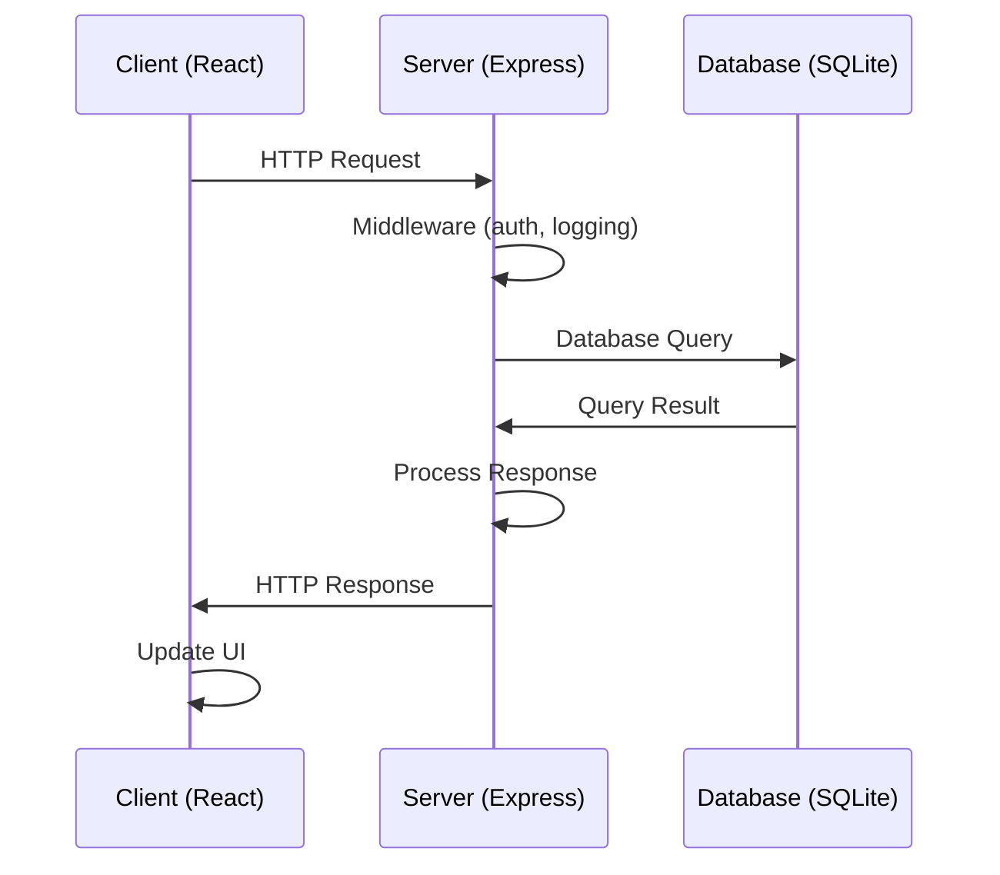
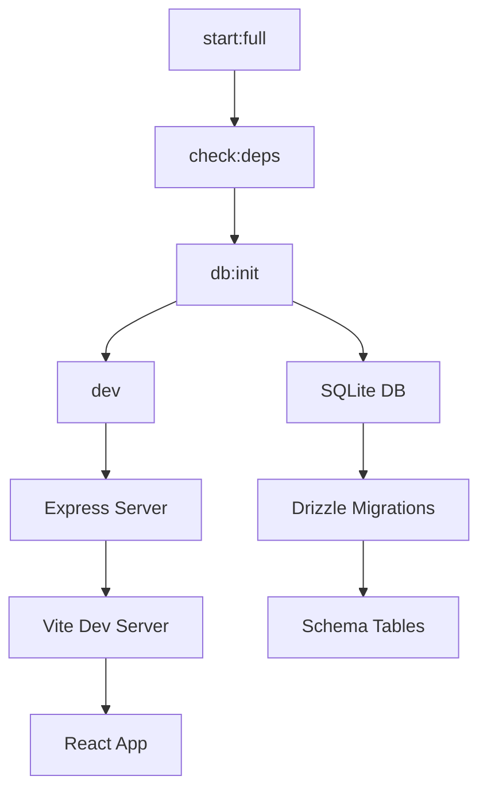

# Архитектура BizStartMaster

## 🏗️ Обзор архитектуры

BizStartMaster - это full-stack веб-приложение для помощи в запуске бизнеса, построенное на архитектуре клиент-сервер с использованием современных технологий.

## 📋 Стек технологий

### Backend (Серверная часть)
- **Runtime**: Node.js
- **Фреймворк**: Express.js
- **Язык**: TypeScript
- **База данных**: SQLite
- **ORM**: Drizzle ORM
- **Драйвер БД**: better-sqlite3
- **Аутентификация**: Passport.js
- **Сессии**: express-session + memorystore

### Frontend (Клиентская часть)
- **Фреймворк**: React 18
- **Сборщик**: Vite
- **Язык**: TypeScript
- **Стили**: Tailwind CSS
- **UI компоненты**: Radix UI
- **Роутинг**: Wouter
- **Формы**: React Hook Form + Zod
- **Запросы**: TanStack Query

### Инструменты разработки
- **Запуск TypeScript**: tsx
- **Миграции БД**: drizzle-kit
- **Сборка**: Vite + esbuild
- **Линтинг**: TypeScript compiler

## 🏛️ Структура приложения

```
BizStartMaster/
├── client/                     # Frontend приложение
│   ├── src/
│   │   ├── components/         # React компоненты
│   │   ├── pages/             # Страницы приложения
│   │   ├── hooks/             # Custom hooks
│   │   ├── utils/             # Утилиты
│   │   └── main.tsx           # Точка входа
│   ├── public/                # Статические файлы
│   └── index.html             # HTML шаблон
├── server/                     # Backend приложение
│   ├── index.ts               # Главный файл сервера
│   ├── routes.ts              # Определение маршрутов API
│   ├── db.ts                  # Конфигурация базы данных
│   ├── db-sqlite.ts           # SQLite подключение
│   ├── storage.ts             # Работа с хранилищем
│   └── vite.ts                # Vite интеграция
├── shared/                     # Общий код
│   └── schema.ts              # Схемы базы данных и валидации
├── scripts/                    # Скрипты автоматизации
│   ├── db-init.ts             # Инициализация БД
│   ├── db-check.ts            # Проверка БД
│   ├── db-reset.ts            # Сброс БД
│   └── check-deps.ts          # Проверка зависимостей
├── local.db                    # Файл базы данных SQLite
├── package.json               # Зависимости и скрипты
├── tsconfig.json              # Конфигурация TypeScript
├── vite.config.ts             # Конфигурация Vite
├── drizzle.config.ts          # Конфигурация Drizzle
└── .env                       # Переменные окружения
```

## 🔄 Поток данных

### Запрос от клиента к серверу


### Инициализация приложения


## 🗄️ Архитектура базы данных

### Текущая схема
```sql
-- Таблица пользователей
CREATE TABLE users (
    id TEXT PRIMARY KEY,                    -- UUID v4
    username TEXT UNIQUE NOT NULL,         -- Имя пользователя
    password TEXT NOT NULL                 -- Хеш пароля
);
```

### Валидация
- Использует Zod схемы для валидации данных
- Типизация через TypeScript inference
- Схемы определены в `shared/schema.ts`

## 🔐 Безопасность

### Аутентификация
- Passport.js для аутентификации
- Локальная стратегия (username/password)
- Хеширование паролей (требуется реализация)

### Сессии
- express-session для управления сессиями
- memorystore для хранения сессий в памяти
- Настройка через переменные окружения

### Безопасность API
- Middleware для логирования запросов
- Валидация входных данных через Zod
- CORS настройки (требуется реализация)

## 🚀 Скрипты запуска

### Основные скрипты
- **start:full**: Полный цикл запуска проекта
- **dev**: Запуск в режиме разработки
- **build**: Сборка production версии
- **start**: Запуск production версии

### Управление БД
- **db:init**: Инициализация базы данных
- **db:check**: Проверка состояния БД
- **db:reset**: Полный сброс БД
- **db:push**: Применение миграций

### Проверки
- **check:deps**: Проверка зависимостей
- **status**: Общая проверка состояния проекта
- **check**: Проверка TypeScript

## 🔧 Конфигурация

### Переменные окружения
```env
# База данных
DATABASE_URL=sqlite:./local.db

# Сервер
PORT=5000
NODE_ENV=development

# Сессии
SESSION_SECRET=your-secret-key-here-change-in-production
```

### TypeScript конфигурация
- ESNext модули
- Строгая типизация
- Пути алиасы: `@/`, `@shared/`
- Поддержка React JSX

### Vite конфигурация
- React плагин
- Алиасы путей
- Dev сервер интеграция с Express
- Production сборка в `dist/public`

## 📦 Зависимости

### Production зависимости
- **express**: Веб-фреймворк
- **react**: UI библиотека
- **drizzle-orm**: ORM для базы данных
- **better-sqlite3**: Драйвер SQLite
- **zod**: Валидация данных
- **wouter**: Легковесный роутинг

### Development зависимости
- **tsx**: Запуск TypeScript
- **vite**: Сборщик и dev сервер
- **drizzle-kit**: Управление миграциями
- **typescript**: Компилятор TypeScript
- **@types/***]: TypeScript определения

## 🔄 Жизненный цикл разработки

### 1. Настройка окружения
```bash
npm run setup:dev  # Установка зависимостей и инициализация БД
```

### 2. Разработка
```bash
npm run dev        # Запуск dev сервера
npm run check      # Проверка типов
npm run db:push    # Применение изменений в БД
```

### 3. Тестирование
```bash
npm run status     # Проверка состояния проекта
npm run db:check   # Проверка БД
```

### 4. Production
```bash
npm run build      # Сборка проекта
npm run start      # Запуск production версии
```

## 🚀 Масштабирование

### Горизонтальное масштабирование
- Легкая миграция на PostgreSQL через Drizzle
- Добавление Redis для сессий
- Балансировка нагрузки через Nginx

### Вертикальное масштабирование
- Кэширование запросов к БД
- Оптимизация React компонентов
- Ленивая загрузка модулей

## 🔮 Будущие улучшения

### Безопасность
- JWT токены вместо сессий
- Rate limiting
- CORS настройки
- HTTPS поддержка

### Производительность
- Кэширование Redis
- CDN для статических файлов
- Оптимизация сборки

### Функциональность
- Расширение схемы БД
- API документация
- Тестирование (unit, integration)
- CI/CD pipeline

## 📝 Принципы разработки

1. **Type Safety**: Максимальное использование TypeScript
2. **Simplicity**: Простая и понятная архитектура
3. **Automation**: Автоматизация рутинных задач
4. **Security**: Безопасность по умолчанию
5. **Performance**: Оптимизация производительности
6. **Maintainability**: Легкость поддержки и расширения